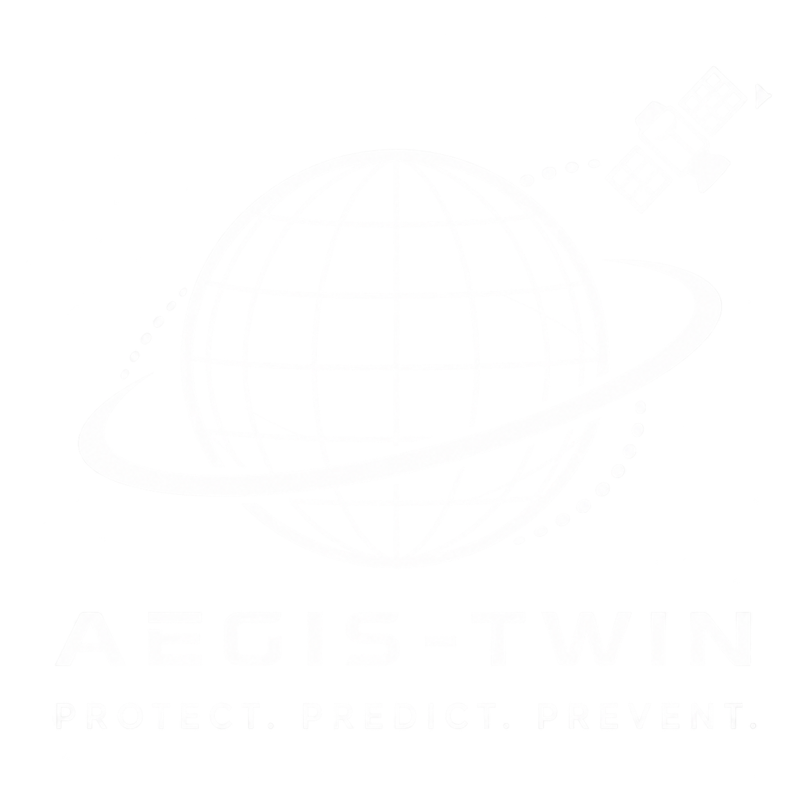

# AEGIS-TWIN



## Autonomous FDIR Coprocessor for CubeSats

AEGIS-TWIN is a hackathon-grade demonstration of bounded spacecraft autonomy for small satellites.
It shows how an advisory AI coprocessor can help diagnose ambiguous onboard faults while the
deterministic onboard computer remains the only authority allowed to execute recovery actions.

The core idea is simple:

```text
AI diagnoses. The twin predicts. Deterministic logic decides.
```

AEGIS-TWIN is not a free-form spacecraft controller. It is a safety-bounded decision architecture.
The AI module wakes only when the Master OBC detects ambiguity, proposes a recovery template, and then
goes back to sleep. Before anything can happen, a lightweight digital twin simulates candidate futures,
and the OBC applies hard safety gates for voltage, current, temperature, state of charge, whitelist
membership, freshness, and watchdog timing.

## Made BY Team Made2Gether

This project was built by **Team Made2Gether**:

- Mayank
- Aryan Jha
- Mukund Naidu
- Ishant lala
- Sushant Kumar Choudary

## Problem Statement

CubeSats often operate with limited power, constrained compute, intermittent ground contact, and harsh
orbital conditions. A satellite in low Earth orbit can spend long windows outside direct communication
with a ground station. During that radio-silent period, the spacecraft may experience:

- Radiation-induced bit flips
- Sensor corruption
- ADCS thermal spikes
- Power bus sag
- Battery heating
- Low solar input during eclipse
- Conflicting subsystem telemetry

Traditional flight software is intentionally deterministic and conservative. That is good for safety,
but it can also make ambiguous faults difficult to diagnose when the spacecraft is isolated. AEGIS-TWIN
demonstrates a middle path: use AI only as an advisory diagnostic engine, surround it with deterministic
guards, and require every recovery action to pass a predictive simulation before execution.

## What AEGIS-TWIN Demonstrates

AEGIS-TWIN demonstrates an onboard fault detection, isolation, and recovery loop:

1. **Master OBC monitors telemetry**
   The deterministic onboard computer remains active at all times and owns the spacecraft authority boundary.

2. **Ambiguous anomaly is detected**
   A voltage, thermal, current, SOC, or telemetry consistency problem triggers the advisory flow.

3. **AEGIS-TWIN coprocessor wakes**
   The AI edge module is powered through a GPIO-controlled power gate and given a watchdog-limited compute window.

4. **AI diagnoses the fault**
   The coprocessor ranks possible causes and recovery templates, but it cannot issue raw actuator commands.

5. **Digital twin simulates candidate futures**
   Each pre-approved recovery template is simulated across a short prediction horizon.

6. **Hard safety gates evaluate outcomes**
   Candidate actions are rejected if they violate voltage, temperature, current, SOC, whitelist, freshness,
   or watchdog constraints.

7. **OBC executes only approved templates**
   The Master OBC executes a deterministic, pre-whitelisted recovery routine if and only if safety checks pass.

8. **AI returns to sleep**
   The coprocessor power domain is disabled after the bounded advisory window.

## Repository Layout

```text
.
|-- README.md
|-- logo.png
|-- CODEX_HANDOFF.md
|-- aegis-fdir-dashboard.html
|-- aegis-mission-control.html
|-- aegis-mission-control-v2.html
|-- aegis-twin/
|   |-- package.json
|   |-- docker-compose.yml
|   |-- apps/
|   |   |-- simulator/
|   |   |   |-- server.py
|   |   |   |-- schemas.py
|   |   |   |-- mission.py
|   |   |   |-- digital_twin.py
|   |   |   |-- anomaly_model.py
|   |   |   |-- templates.py
|   |   |   |-- requirements.txt
|   |   |-- web/
|   |       |-- app/
|   |       |-- components/
|   |       |-- lib/
|   |       |-- public/
|   |       |-- package.json
|   |-- data/
|   |   |-- evidence/
|   |   |-- scenarios/
|   |   |-- templates/
|   |-- tests/
|       |-- e2e/
|       |-- protocol/
|       |-- twin/
|-- aegis_twin_micro_sim/
    |-- dashboard.py
    |-- digital_twin.py
    |-- obc_demo.py
    |-- requirements.txt
```

## Main Application

The main app lives in `aegis-twin/`.

It contains:

- A **Next.js 16 + React + TypeScript** frontend
- A **FastAPI** simulation backend
- A reduced-order digital twin model
- A mission-control dashboard
- A pitch/demo mode with 3D spacecraft visuals
- Fault injection controls
- Protocol rejection scenarios
- Watchdog timeout behavior
- Candidate recovery branch comparison
- Safety gate visualization
- JSON OBC proposal replay

## Frontend Features

The frontend provides a judge-facing interactive demo:

- 3D CubeSat scene
- LEO orbit / radio silence simulator
- Ground pass visualization
- AI coprocessor power state
- Master OBC state
- Watchdog ring and timeout behavior
- Fault injection controls
- Telemetry sliders
- Three candidate ghost futures
- PASS / BLOCK safety gate cards
- OBC terminal replay
- JSON proposal viewer
- Team Made2Gether credit overlay
- AEGIS-TWIN PNG branding
- Mobile-friendly and landscape-friendly pitch screen

## Backend Features

The FastAPI backend provides the simulator and protocol endpoints:

- `GET /health`
- `GET /scenarios`
- `GET /templates`
- `POST /simulate`
- `WS /ws/events`

The backend evaluates candidate recovery templates using a simplified predictive model and returns:

- Mission events
- Terminal replay lines
- AI diagnostic confidence
- Safety validation result
- Selected template ID
- Rejection reason, if any
- Top candidate recoveries
- Predicted bus voltage
- Predicted battery temperature
- Predicted electronics temperature
- Predicted current draw
- Safety margin checks

## Run Locally

### 1. Clone the repository

```bash
git clone https://github.com/codermukundnaidu/aegistwin.git
cd aegistwin/aegis-twin
```

### 2. Install frontend dependencies

```bash
npm install
```

### 3. Start the backend

On Windows PowerShell:

```powershell
cd apps\simulator
python -m venv .venv
.\.venv\Scripts\pip.exe install -r requirements.txt
.\.venv\Scripts\python.exe -m uvicorn server:app --host 0.0.0.0 --port 8000 --reload
```

On macOS/Linux:

```bash
cd apps/simulator
python3 -m venv .venv
source .venv/bin/activate
pip install -r requirements.txt
uvicorn server:app --host 0.0.0.0 --port 8000 --reload
```

### 4. Start the frontend

From `aegis-twin/`:

```bash
npm run dev
```

Open:

```text
http://localhost:7860
```

Backend docs:

```text
http://localhost:8000/docs
```

Backend health check:

```text
http://localhost:8000/health
```

Expected health response:

```json
{
  "ok": true,
  "model_version": "aegis-rom-0.3"
}
```

## Mobile Testing

If the frontend is running with host `0.0.0.0`, another device on the same network can open the app using
the machine's LAN IP address.

Example:

```text
http://<LAN-IP>:7860
```

Backend docs from another device:

```text
http://<LAN-IP>:8000/docs
```

## Demo Flow for Judges

Use this sequence for a clear live presentation:

1. Start on the pitch screen.
2. Explain the blackout problem: a CubeSat must survive between ground passes.
3. Show the architecture: Master OBC remains deterministic, AEGIS-TWIN only advises.
4. Show the process: AI diagnosis, digital twin prediction, hard safety gates, OBC execution.
5. Initialize the FDIR demo.
6. Show the nominal dashboard state.
7. Inject a critical anomaly.
8. Point to the changed telemetry: low bus voltage, high thermal state, increased load.
9. Show the ghost futures.
10. Explain why unsafe branches are blocked.
11. Show the selected safe branch, if one passes.
12. Open the proposal JSON and point out that it contains a template ID, not raw actuator commands.
13. Trigger the watchdog scenario.
14. Explain that if the AI misses the compute window, the OBC powers it down and falls back deterministically.
15. Show that the dashboard auto-resets to nominal after the watchdog/recovery window.

## Fault Scenarios

The demo includes several kinds of anomaly and protocol cases:

- **Critical anomaly**
  Simulates a thermal spike and bus voltage collapse.

- **ADCS thermal runaway**
  Demonstrates safety-gate rejection when thermal bounds are exceeded.

- **SEU bit-flip / watchdog timeout**
  Demonstrates that the AI can fail or miss a heartbeat without taking the spacecraft with it.

- **Unknown sensor corruption**
  Demonstrates malformed proposal rejection.

- **Unknown template**
  Shows that the OBC rejects templates outside its whitelist.

- **Stale proposal**
  Shows that old proposals cannot be executed after their freshness window expires.

- **Malformed message**
  Shows that badly shaped AI outputs are rejected before execution.

## Digital Twin Model

The project uses a reduced-order physics-inspired model. It is intentionally compact and explainable
for a hackathon demo.

### Electrical Model

The simulator approximates:

- Battery open-circuit voltage from state of charge
- Load versus solar input
- Battery current from power demand
- Bus voltage sag from internal resistance
- Converter efficiency
- Extra anomaly load

### Thermal Model

The simulator uses a first-order lumped thermal model:

```text
C * dT/dt = P_generated - (T - T_ambient) / R_thermal
```

It tracks:

- Battery temperature
- Electronics temperature
- Anomaly heat injection
- Recovery-related thermal impact

### Safety Envelope

The OBC evaluates candidate futures against hard constraints:

- Minimum bus voltage
- Maximum battery temperature
- Maximum electronics temperature
- Maximum battery current
- Minimum battery state of charge

If any hard limit fails, the action is blocked.

## Proposal Contract

AEGIS-TWIN returns a structured proposal similar to:

```json
{
  "message_type": "AEGIS_RECOVERY_PROPOSAL",
  "template_id": "SAFE_MODE",
  "ai_diagnostic_confidence": 0.91,
  "twin_validation": "PASS",
  "twin_safety_score": 0.807,
  "predicted_min_bus_voltage_v": 6.995,
  "predicted_max_battery_temp_c": 42.0,
  "predicted_max_electronics_temp_c": 50.99,
  "predicted_max_current_a": 0.656,
  "issued_at_s": 5.2,
  "expires_at_s": 13.2,
  "execute_authority": "OBC_ONLY"
}
```

Important design choice:

AEGIS-TWIN does **not** send raw actuator commands. It proposes only a pre-approved recovery template.
The Master OBC decides whether the template is valid, fresh, safe, and whitelisted.

## Watchdog Safety

The watchdog is a core trust-boundary feature.

The AI coprocessor:

- Is normally asleep
- Wakes only during ambiguity
- Has a bounded compute window
- Must produce a valid proposal before the deadline
- Can be powered down by the OBC
- Cannot keep authority after the watchdog window

If the watchdog expires, the simulator rejects the AI proposal and returns control to the deterministic
fallback path.

## Testing

Frontend build:

```bash
cd aegis-twin
npm run build
```

Protocol tests:

```bash
cd aegis-twin
python -m pytest tests/protocol
```

Digital twin tests:

```bash
cd aegis-twin
python -m pytest tests/twin
```

End-to-end tests:

```bash
cd aegis-twin/apps/web
npx playwright test
```

## Docker

The repository includes Docker configuration for running the app stack:

```bash
cd aegis-twin
docker compose up --build
```

## Legacy / Standalone Prototypes

The repository also contains standalone and earlier prototypes:

- `aegis-mission-control.html`
- `aegis-mission-control-v2.html`
- `aegis-fdir-dashboard.html`
- `aegis_twin_micro_sim/`

These helped shape the final demo experience and are kept for reference, quick offline viewing, and
alternate presentation modes.

## What This Project Is

AEGIS-TWIN is:

- A hackathon prototype
- An interactive architecture demonstrator
- A reduced-order digital twin simulator
- A safety-gated autonomy concept
- A visual explanation of AI-assisted spacecraft FDIR

## What This Project Is Not

AEGIS-TWIN is not:

- Flight-qualified software
- A high-fidelity spacecraft simulator
- A replacement for mission-specific FDIR design
- A substitute for hardware-in-the-loop validation
- A free-form AI controller
- A system that allows an LLM or model to command actuators directly

## Future Work

Possible extensions:

- Hardware-in-the-loop test bench
- Mission-specific EPS and thermal calibration
- Radiation event modeling
- More recovery templates
- Formal command whitelist configuration
- Persistent onboard event log
- Real telemetry import
- Better ADCS and battery subsystem models
- Fault tree / FMEA linkage
- Automated verification reports
- Git LFS for large 3D model assets

## Safety Statement

This project demonstrates a decision architecture using reduced-order predictive micro-simulation.
A real flight implementation would require mission-specific modeling, verification, validation,
qualification, radiation analysis, hardware-in-the-loop testing, FMEA/FMECA, configuration-controlled
templates, and mission-level safety review.

## License

No explicit license has been selected yet. Treat the project as all rights reserved unless a license is
added by the team.
